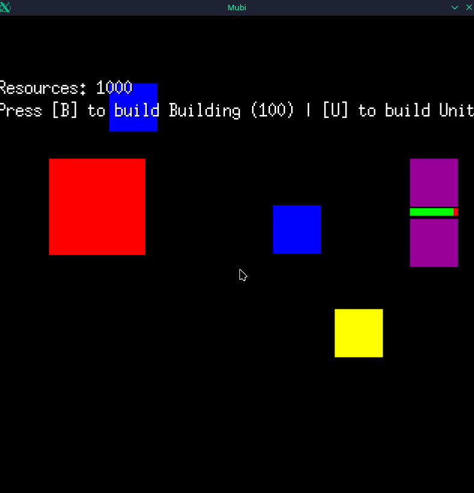

# 2D RTS Game

A small-scale 2D Real-Time Strategy game inspired by classics like **C&C: Red Alert 2** and **Age of Empires**, developed using the **Ebitengine** framework in Go. This project serves as a learning experience for game development and a showcase of Go programming skills.




---

## Project Roadmap

### Phase 1: The Core Foundation (Completed ✔️)

This phase built the minimum viable product (MVP) with all fundamental RTS mechanics in place.

* `[x]` **Core Engine:** Setup Ebitengine, game loop, and window.
* `[x]` **Code Structure:** Refactored core logic from `main.go` into a clean `internal/game` package (e.g., `input.go`, `update.go`, `unit.go`).
* `[x]` **Unit Management:** Mouse-based selection (single click and drag-box) and movement (right-click).
* `[x]` **State Machine:** Implemented a robust state machine for units (`StateIdle`, `StateMoving`, `StateHarvesting`, etc.).
* `[x]` **Resource System:** A complete resource loop: units harvest from nodes, carry resources, and return to a drop-off point, updating a global resource counter.
* `[x]` **Building & Production:** A system to spend resources (via key-press) to produce new units from a building over time.
* `[x]` **Combat System:** Units have teams, HP, and stats. They can attack-move, engage enemies, deal damage, and are removed upon death. Includes health bars.
* `[x]` **Basic Collision:** Implemented "bounding box" collision detection to make buildings and resource nodes "solid" objects.

---

### Phase 2: The "Real" RTS Loop (Current Focus)

This phase focuses on upgrading the core systems from "functional" to "fun" and implementing proper game mechanics.

* `[ ]` **Basic UI/HUD:** Implement a simple UI panel to display selected unit info and a command bar (e.g., "Build", "Attack" buttons).
* `[ ]` **Worker-Based Building:**
    * `[ ]` Allow workers (current unit) to be commanded to build structures.
    * `[ ]` Implement a building-placement mode (show a "ghost" building on the cursor).
    * `[ ]` Create new unit states (`StateMovingToBuild`, `StateBuilding`).
* `[ ]` **Tiled Map System:** Replace the black void with a proper 2D map rendered from a tilemap (e.g., using `tmx` files from the Tiled editor).
* `[ ]` **Basic Pathfinding:** Upgrade from simple collision-stop to a basic A\* (A-Star) algorithm so units can navigate *around* obstacles.
* `[ ]` **Camera Controls:** Implement basic camera scrolling (e.g., with arrow keys or mouse-at-edge).

---

### Phase 3: Factions & Polish

Once the core loop is solid, this phase will introduce variety and audiovisual feedback.

* `[ ]` **Faction System:** Implement a structure for multiple factions (USA, GBA, EU, China, Anime, etc.).
* `[ ]` **Unique Units & Buildings:** Create the first two distinct factions with unique units and structures.
* `[ ]` **Sprite & Animation System:** Replace the colored squares with actual 2D sprites.
    * `[ ]` Implement sprite sheets for animations (e.g., walking, attacking, harvesting).
* `[ ]` **Audio System:** Implement basic sound effects (clicks, attacks, "unit ready") and background music.
* `[ ]` **Basic Skirmish AI:** Create a simple AI opponent that can build a base, harvest resources, and send attack waves.

---

### Phase 4: Strategic Depth

This phase adds the "progression" elements inspired by C&C and AoE.

* `[ ]` **Unit Promotion System:** A C&C Generals-inspired system where units gain experience points (XP) and are promoted, unlocking special abilities or stat bonuses.
* `[ ]` **Strategic Upgrades:** An Age of Empires-style upgrade system (e.g., "Iron Broadswords," "Faster Engines") researched at buildings.
* `[ ]` **Campaign Mode:** A single-player tournament tree or a simple, scripted linear campaign.

---

### Phase 5: The Long-Term Vision

These are long-term goals if the project continues to be fun and successful.

* `[ ]` **Map Editor:** A simple in-game or external tool to create and save maps.
* `[ ]` **Multiplayer:** Implement network code for basic 1v1 multiplayer matches.


### Phase x: The crazy ideas

These are just funny ideas.

* `[ ]` **Steam Workshop integration for mods**
* `[ ]` **A co-op campaign and heroes for every faction (Pope, Greek gods, Hatsune Miku)**
* `[ ]` **The option for contributors to create weekly co-op campaigns (e.g., a Jackie Chan co-op campaign or an official Hatsune Miku co-op campaign)**
* `[ ]` **LAN-Mode**
* `[ ]` **Official fun modes like TD or Maul (Warcraft)**


---

## Technologies

* **Go:** The primary programming language.
* **Ebitengine:** A powerful and simple 2D game library for Go.

---

## How to Run

1.  Make sure Go is installed on your system.
2.  Clone the repository:
    ```sh
    git clone https://github.com/blazyng/EbitengineTest.git
    cd [your-cloned-folder]
    ```
3.  Run the game:
    ```sh
    go run ./
    ```
    *(Note: `go run ./` is often more reliable than `go run main.go` in projects with multiple packages)*

---

## Contribution

This is a personal learning project, but any feedback or suggestions are welcome!
